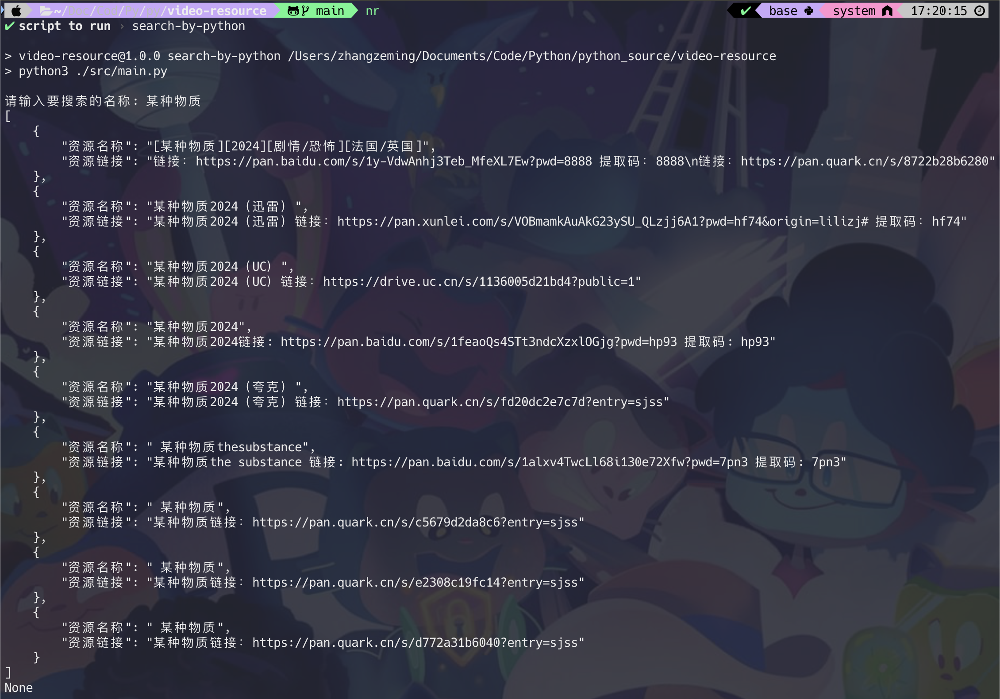

# 影视资源爬虫项目

## ⚠️ 免责声明

> 尊重版权：确保不侵犯任何版权内容，只爬取公开可用的资源。

该项目仅供学习和研究使用，不得用于商业或非法用途。在使用网络爬虫时，请确保遵守目标网站的`robots.txt`文件规定，尊重版权和隐私政策，不要对网站服务器造成不必要的负担。

## 🔗 十分感谢 [isinvon](https://github.com/isinvon) 提供的 GUI 界面，项目地址：[Pvideo-demo](https://github.com/isinvon/Pvideo-demo)

## 🆕 python 版本更新了 m3u8的在线观看爬虫 推荐使用 [m3u8-player](https://m3u8-player.com/) 复制链接在线直接观看

## 🔧 项目概述

本项目旨在使用Python编程语言和BeautifulSoup库来爬取公开可用的影视资源信息。通过此项目，学习者可以了解网络爬虫的基本原理、如何解析HTML页面以及如何以结构化的方式存储数据。

> 当前搜索 `python` 版本搜索资源更全一些。

<details open> 
  <summary><h2>📘 python 运行</h2></summary>

### 1、python 环境

在开始之前，请确保你的开发环境已经安装了以下软件和库：

- python 3.x
- pip（python包管理器）
- requests库：用于发送HTTP请求
- json库：用于处理JSON数据
- time库：用于处理时间戳

### 2、安装依赖

在开始之前，请确保你的Python环境已经安装了以下库：

```bash
pip install requests json time
```

### 3、运行代码

```bash
# python 直接运行
python main.py

# 执行 package 命令
npm run search-video-by-python
```



</details>

---

> 请记住，这只是一个模板，实际的爬虫项目需要根据目标网站的具体结构进行相应的调整。此外，实际使用时还应考虑到法律和道德问题。
